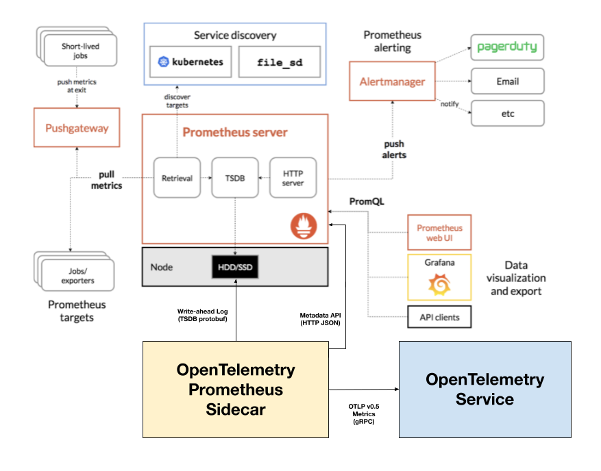

# OpenTelemetry Prometheus sidecar

This repository contains a sidecar for the
[Prometheus](https://prometheus.io/) Server that sends metrics data to
an [OpenTelemetry](https://opentelemetry.io) Metrics Protocol endpoint.  This
software is derived from the [Stackdriver Prometheus
Sidecar](https://github.com/Stackdriver/stackdriver-prometheus-sidecar).



## Repository Status (11/18/2020)

This repository will be archived after the 0.2 release.  [We are
moving this
repository](https://github.com/open-telemetry/community/issues/575)
into the [OpenTelemetry](https://opentelemetry.io/)
[organization](http://github.com/open-telemetry) and [will continue
development on a public fork](https://github.com/open-telemetry/prometheus-sidecar) of the [upstream Stackdriver Prometheus
sidecar](https://github.com/Stackdriver/stackdriver-prometheus-sidecar)
repository.

This code base is 100% OpenTelemetry and Prometheus, not a Lightstep
project.

## OpenTelemetry Design

A key difference between the OpenTelemetry Metrics data model and the
Prometheus or OpenMetrics data models is the introduction of a
[Resource concept](https://github.com/open-telemetry/opentelemetry-specification/blob/master/specification/resource/sdk.md)
to describe the unit of computation or the entity responsible for
producing a batch of metric data.

The function of this sidecar is to read data collected and written by
Prometheus, convert into the OpenTelemetry data model, attach Resource
attributes, and write to an OpenTelemetry endpoint.

This sidecar sends [OpenTelemetry Protocol](https://github.com/open-telemetry/opentelemetry-specification/blob/master/specification/protocol/otlp.md) [version 0.5](https://github.com/open-telemetry/opentelemetry-proto/releases/tag/v0.5.0) (or later versions) over gRPC.

## Prometheus Design

The Prometheus server consists of a number of interacting parts that
relate to the sidecar.

1. Service discovery. Prometheus has over 15 builtin service discovery strategies, which serve to fetch and dynamically update the set of targets.
2. Job configuration. A Prometheus job is identified by the name of its confuration, which includes service dicovery, followed by [_target relabeling_](https://prometheus.io/docs/prometheus/latest/configuration/configuration/#relabel_config), followed by [_general relabeling_](https://prometheus.io/docs/prometheus/latest/configuration/configuration/#metric_relabel_configs).
3. Label discovery and relabeling.  Service discovery-specific labels, prefixed by `__meta_`, are made available for use during relabeling rules.  Prometheus relabeling configurations must choose which meta-labels to output through relabeling, otherwise no `__`-prefixed keys are kept.  All timeseries have `job` and `instance` labels.
4. In-memory metadata database.  The Prometheus server maintains metadata about both active targets and active metric instruments in memory, including the "discovered" meta-labels.
5. Write-ahead log.  After targets discovered, their meta-labels are synthesized, and relabeling steps are taken, the output following each collection is written to a write-ahead log.  Other Prometheus components consume this log.

Critically, the Prometheus write-ahead log does not include timeseries metadata that the Prometheus server expects will be collected again soon, including whether the timeseries represents a counter or a gauge.  Prometheus can be configured to write its write-ahead-log to a remote destination, but systems built on this mechanism must refer back to Prometheus servers or otherwise obtain metadata about the kind of data that is in the log.  Note that Prometheus [_is taking efforts to add metadata to its write-ahead-log_](https://github.com/prometheus/prometheus/pull/6815), though it [appears unlikely to make it into the 2.23 release](https://github.com/prometheus/prometheus/pull/7771#issuecomment-707639237).

## Sidecar design

The sidecar includes:

1. Prometheus write-ahead log reader
2. Target cache that tracks active targets by their identifying labels
3. Metadata cache that tracks active instruments, by target
4. Configured settings:
* Extra resource labels to apply to all metric timeseries
* Renaming and prefixing to change the name of metric timeseries
* Filters to avoid reporting specific metric timeseries
* Specify whether to use use int64 (optional) vs. double (default) protocol encoding
* Whether to include all meta-labels as resource labels.

The sidecar operates by continually (and concurrently) reading the
log, refreshing its view of targets and instrument metadata,
transforming the data into OpenTelemetry Protocol metrics, and sending
over gRPC to an OpenTelemetry metrics service.

### Target label discovery

The sidecar uses Prometheus server HTTP `api/v1/targets/metadata` API
to obtain metadata about active collection targets and metric
instruments.  The result of target metadata retrieval includes:

1. The set of identifying target labels, which include the application
metric labels plus those applied during Prometheus relabeling rules; this always includes `job` and `instance`
2. The set of "discovered" target labels, which includes Prometheus metadata (e.g., `__scheme__`, `__address__`) and the service-discovery meta-labels (e.g., `__meta_kubernetes_pod_name`).

When reporting timeseries to output destination, the identifying
target labels are included as OpenTelemetry resource attributes.  The
`--destination.attribute` flag can be used to add addional constant
labels as resource attributes.  The `--opentelemetry.use-meta-labels` flag
can be used to add all meta labels as resource attribuets.  Otherwise,
labels beginning with `__` are dropped.

## Installation

Lightstep publishes Docker images of this binary named
`lightstep/opentelemetry-prometheus-sidecar:${VERSION}`, with the
latest release always tagged `latest`.

To build from source, please clone this repository.  You will build a
Docker image, push it to a private container registry, and then run
the container as described below.  To test and build a Docker image
for the current operating system, simply:

```
export DOCKER_IMAGE_NAME=my.image.reposito.ry/opentelemetry/prometheus-sidecar
export DOCKER_IMAGE_TAG=$(cat ./VERSION)
make docker
docker push ${DOCKER_IMAGE_NAME}:${DOCKER_IMAGE_TAG}
```

## Deployment

The sidecar is deployed next to an already running Prometheus server.

An example command-line:

```
opentelemetry-prometheus-sidecar \
  --destination.endpoint=${DESTINATION} \
  --destination.header="Custom-Header=${VALUE}" \
  --destination.attribute="service.name=${SERVICE}" \
  --prometheus.wal=${WAL} \
  --prometheus.endpoint=${PROMETHEUS} \
```

where:

* `DESTINATION`: Destination address https://host:port
* `VALUE`: Value for the `Custom-Header` request header
* `SERVICE`: Value for the `service.name` resource attribute
* `WAL`: Prometheus' WAL directory, defaults to `data/wal`
* `PROMETHEUS`: URL of the Prometheus UI.

Settings can also be passed through a configuration file, for example:

```
destination:
  endpoint: https://otlp.io:443
  headers:
    Custom-Header: custom-value
  attributes:
    service.name: my-service-name
prometheus:
  wal: /prometheus/wal
  endpoint: http://192.168.10.10:9191
```

The sidecar requires write access to the directory to store its progress between restarts.

### Kubernetes and Helm setup

To configure the sidecar for a Prometheus server installed using the
[Prometheus Community Helm Charts](https://github.com/prometheus-community/helm-charts). 

#### Sidecar Setup
To configure the core compoents of the Prometheus sidecar, add the following definition to your custom `values.yaml`:

```
server:
  sidecarContainers:
  - name: otel-sidecar
    image: lightstep/opentelemetry-prometheus-sidecar
    imagePullPolicy: Always
    args:
    - --prometheus.wal=/data/wal
    - --destination.endpoint=$(DESTINATION)
    - --destination.header=Access-Token=AAAAAAAAAAAAAAAA
    - --diagnostics.endpoint=$(DIAGNOSTICS_DESTINATION)
    - --diagnostics.header=Access-Token=BBBBBBBBBBBBBBBB
    volumeMounts:
    - name: storage-volume
      mountPath: /data
```
The [upstream Stackdriver Prometheus sidecar Kubernetes
README](https://github.com/Stackdriver/stackdriver-prometheus-sidecar/blob/master/kube/README.md)
contains more examples of how to patch an existing Prometheus
deployment or deploy the sidecar without using Helm.

#### Health Check Handler Probe Settings
The Prometheus Sidecar package also comes with a health check handlers that respond to k8s probes.  To modify the configurations on the probes, use a stanza similar to the following example: 

```
    livenessProbe:
      httpGet:
        path: /-/health
        port: admin-port
      periodSeconds: 5

    readinessProbe:
      httpGet:
        path: /-/ready
        port: admin-port
      failureThreshold: 6
      periodSeconds: 10
```

### Configuration

Most sidecar configuration settings can be set through flags or a yaml
configuration file. To see all available flags, run
`opentelemetry-prometheus-sidecar --help`.  The printed usage is shown
below:

```
usage: opentelemetry-prometheus-sidecar [<flags>]

The OpenTelemetry Prometheus sidecar runs alongside the Prometheus (https://prometheus.io/) Server and sends metrics
data to an OpenTelemetry (https://opentelemetry.io) Protocol endpoint.

Flags:
  -h, --help                     Show context-sensitive help (also try --help-long and --help-man).
      --version                  Show application version.
      --config-file=CONFIG-FILE  A configuration file.
      --destination.endpoint=DESTINATION.ENDPOINT  
                                 Destination address of a OpenTelemetry Metrics protocol gRPC endpoint (e.g.,
                                 https://host:port). Use "http" (not "https") for an insecure connection.
      --destination.attribute=DESTINATION.ATTRIBUTE ...  
                                 Destination resource attributes attached to OTLP data (e.g., MyResource=Value1).
                                 May be repeated.
      --destination.header=DESTINATION.HEADER ...  
                                 Destination headers used for OTLP requests (e.g., MyHeader=Value1). May be
                                 repeated.
      --destination.timeout=DESTINATION.TIMEOUT  
                                 Destination timeout used for OTLP Export() requests
      --diagnostics.endpoint=DIAGNOSTICS.ENDPOINT  
                                 Diagnostics address of a OpenTelemetry Metrics protocol gRPC endpoint (e.g.,
                                 https://host:port). Use "http" (not "https") for an insecure connection.
      --diagnostics.attribute=DIAGNOSTICS.ATTRIBUTE ...  
                                 Diagnostics resource attributes attached to OTLP data (e.g., MyResource=Value1).
                                 May be repeated.
      --diagnostics.header=DIAGNOSTICS.HEADER ...  
                                 Diagnostics headers used for OTLP requests (e.g., MyHeader=Value1). May be
                                 repeated.
      --diagnostics.timeout=DIAGNOSTICS.TIMEOUT  
                                 Diagnostics timeout used for OTLP Export() requests
      --prometheus.wal=PROMETHEUS.WAL  
                                 Directory from where to read the Prometheus TSDB WAL. Default: data/wal
      --prometheus.endpoint=PROMETHEUS.ENDPOINT  
                                 Endpoint where Prometheus hosts its UI, API, and serves its own metrics. Default:
                                 http://127.0.0.1:9090/
      --prometheus.max-point-age=PROMETHEUS.MAX-POINT-AGE  
                                 Skip points older than this, to assist recovery. Default: 25h0m0s
      --admin.port=ADMIN.PORT    Administrative port this process listens on. Default: 9091
      --admin.listen-ip=ADMIN.LISTEN-IP  
                                 Administrative IP address this process listens on. Default: 0.0.0.0
      --security.root-certificate=SECURITY.ROOT-CERTIFICATE ...  
                                 Root CA certificate to use for TLS connections, in PEM format (e.g., root.crt). May
                                 be repeated.
      --opentelemetry.metrics-prefix=OPENTELEMETRY.METRICS-PREFIX  
                                 Customized prefix for exporter metrics. If not set, none will be used
      --opentelemetry.use-meta-labels  
                                 Prometheus target labels prefixed with __meta_ map into labels.
      --filter=FILTER ...        PromQL metric and label matcher which must pass for a series to be forwarded to
                                 OpenTelemetry. If repeated, the series must pass any of the filter sets to be
                                 forwarded.
      --startup.delay=STARTUP.DELAY  
                                 Delay at startup to allow Prometheus its initial scrape. Default: 1m0s
      --startup.timeout=STARTUP.TIMEOUT  
                                 Timeout at startup to allow the endpoint to become available. Default: 5m0s
      --log.level=LOG.LEVEL      Only log messages with the given severity or above. One of: [debug, info, warn,
                                 error]
      --log.format=LOG.FORMAT    Output format of log messages. One of: [logfmt, json]
      --log.verbose=LOG.VERBOSE  Verbose logging level: 0 = off, 1 = some, 2 = more; 1 is automatically added when
                                 log.level is 'debug'; impacts logging from the gRPC library in particular
      --disable-supervisor       Disable the supervisor.
      --disable-diagnostics      Disable diagnostics by default; if unset, diagnostics will be auto-configured to
                                 the primary destination

```

Two kinds of sidecar customization are available only through the
configuration file.  An [example sidecar yaml configuration documents
the available options](./sidecar.yaml).

Command-line and configuration files can be used at the same time,
where command-line parameter values override configuration-file
parameter values, with one exception.  Configurations that support
a map from string to string, including both request headers and
resource attributes, are combined from both sources.

#### Resources

Use the `--destination.attribute=KEY=VALUE` flag to add additional resource attributes to all exported timeseries.

Use the `--opentelemetry.use-meta-labels` flag to add discovery meta-labels to all exported timeseries.


#### Filters
	
The `--filter` flag allows to provide filters which all series have to pass before being sent to the destination. Filters use the same syntax as [Prometheus instant vector selectors](https://prometheus.io/docs/prometheus/latest/querying/basics/#instant-vector-selectors), e.g.:

```
opentelemetry-prometheus-sidecar --filter='{__name__!~"cadvisor_.+",job="k8s"}' ...
```

This drops all series which do not have a `job` label `k8s` and all metrics that have a name starting with `cadvisor_`.

For equality filter on metric name you can use the simpler notation, e.g. `--filter='metric_name{label="foo"}'`.

The flag may be repeated to provide several sets of filters, in which case the metric will be forwarded if it matches at least one of them.

#### Metric renames

To change the name of a metric as it is exported, use the
`metric_renames` section in the configuration file:

```yaml
metric_renames:
  - from: original_metric_name
    to: new_metric_name
# - ...
```

#### Static metadata

To change the output type, value type, or description of a metric
instrument as it is exported, use the `static_metadata` section in the
configuration file:

```yaml
static_metadata:
  - metric: some_metric_name
    type: counter # or gauge, or histogram
    value_type: double # or int64
    help: an arbitrary help string
# - ...
```

Note:

* All `static_metadata` entries must have `type` specified.
* If `value_type` is specified, it will override the default value type for counters and gauges. All Prometheus metrics have a default type of double.

## Diagnostics

The sidecar is instrumented with the OpenTelemetry-Go SDK and runs with standard instrumentation packages, including runtime and host metrics and gRPC and HTTP tracing.  

By default, diagnostics are autoconfigured tot he primary destination.  Configuration options are available to disable or configure alternative destinations and options.  

### Configuration Options

Separate diagnostics settings can be configure to output OTLP similar to configuring the primary destination, for example:

```
diagnostics:
  endpoint: https://otel-collector:443
  headers:
    Custom-Header: custom-value
  timeout: timeout-value
  attributes:
    extra.resource: extra-value
```

Likewise, these fields can be accessed using `--diagnostics.endpoint`,
`--diagnostics.header`, `--diagnostics.timeout`, and `--diagnostics.attribute`.

#### Log levels 

The Prometheus sidecar provides options for logging in the case of diagnoising an issue.  
* We recommend starting with setting the `--log.level` to be `debug`, `info`, `warn`, `error`.  
* Additional options are available to set the output format of the logs (`--log.format` to be `logfmt` or `json`), and the number of logs to recorded (`--log.verbose` to be `0` for off, `1` for some, `2` for more)

#### Disabling Diagnostics

To disable diagnostics there are two flags to set.  To disable supervisor diagnostics which sends traces, set `--disable-supervisor` to `true` and to disable subordinate diagnostics which sends metrics `--disable-diagnostics` to `true`.

### Diagnostic Outputs

The Prometheus Sidecar has two main processes, the supervisor and a subordinate process.  Diagnostic traces are sent from the supervisor process and diagnostic metrics are sent from the subordinate process.  

#### Sidecar Supervisor Tracing
Traces from the supervisor process are most helpful for diagnosing unknown problems.  It signals lifecycle events and captures the stderr, attaching it to the trace.  

The sidecar will output spans from its supervisor process with service.name=`opentelemetry-prometheus-sidecar-supervisor`.  There are two kinds of spans: operation=`health-client` and operation=`shutdown-report`.  These spans are also tagged with the attribute `sidecar-health` with values `ok`, `not yet ready` or `first time ready`.  

#### Sidecar Subordinate Metrics
Metrics from the subordinate process can help identify issues once the first metrics are successfully written.  There are 3 host/runtime metrics and 9 internal metrics.  

**Host and Runtime Metrics**
1. process.cpu.time, with tag (state:user,sys)
2. system.network.io, with tag (direction:read,write)
3. runtime.go.mem.heap_alloc

**Internal Metrics**

| Metric Name | Metric Type | Description | Additional Tags |
| --- | --- | --- | ---|
| sidecar.connect.duration.count | histogram | how many attempts to connect (and how long) | (error:true/false) |
| sidecar.export.duration.count | histogram | how many attempts to export (and how long) | (error:true/false) |
| sidecar.queue.outcome | counter | outcome of the sample in the queue | (outcome: success, failed, retry, aborted) |
| sidecar.queue.capacity | gauge | number of available slots for samples (i.e., points) in the queue, counts buffer size times current number of shards | |
| sidecar.queue.running | gauge | number of running shards, those which have not exited | |
| sidecar.queue.shards | gauge | number of current shards, as set by the queue manager | |
| sidecar.samples.produced | counter | number of samples (i.e., points) read from the prometheus WAL | |
| sidecar.queue.size | gauge | number of samples (i.e., points) standing in a queue waiting to export | |
| sidecar.series.dropped | counter | number of points dropped because of missing metadata | (key_reason:target_not_found/metadata_not_found)|


## Upstream

This repository was copied into a private reposotitory from [this upstream fork](https://github.com/Stackdriver/stackdriver-prometheus-sidecar/tree/1361301230bcfc978864a8f4c718aba98bc07a3d) of `stackdriver-prometheus-sidecar`, dated July 31, 2020.

### Changes relative to Stackdriver

Changes relative to `stackdriver-prometheus-sidecar` included in the initial release of `opentelemetry-prometheus-sidecar`:

* Replace Stackdriver monitoring protocol with OTLP v0.5; this was straightforward since these are similar protocols
* Add `--destination.header` support for adding gRPC metadata
* Remove "Resource Map" code, used for generating "Monitored Resource" concept in Stackdriver; OpenTelemetry is less restrictive, this code is replaced by `--destination.attribute` and `--opentelemetry.use-meta-labels` support
* Remove GCP/GKE-specific automatic resources; these can be applied using `--destination.attribute`
* Remove "Counter Aggregator" support, which pre-aggregates labels; there are other ways this could be implemented, if the OpenTelemetry-Go SDK were used to generate OTLP instead of the dedicated code in this repository
* Add `--security.root-certificate` support for supplying the root certificate used in TLS connection setup.

## Compatibility

The matrix below lists the versions of Prometheus Server and other dependencies that have been qualified to work with releases of `opentelemetry-prometheus-sidecar`. If the matrix does not list whether they are compatible, please assume they are not verified yet but can be compatible. Feel free to contribute to the matrix if you have run the end-to-end test between a version of `opentelemetry-prometheus-sidecar` and Prometheus server.

| Sidecar Version | Compatible Prometheus Server Version(s)   | Incompatible Prometheus Server Version(s) |
| -- | -- | -- |
| **0.1.x**       | 2.10, 2.11, 2.13, 2.15, 2.16, 2.18, 2.19, 2.21, 2.22 | 2.5                                       |
